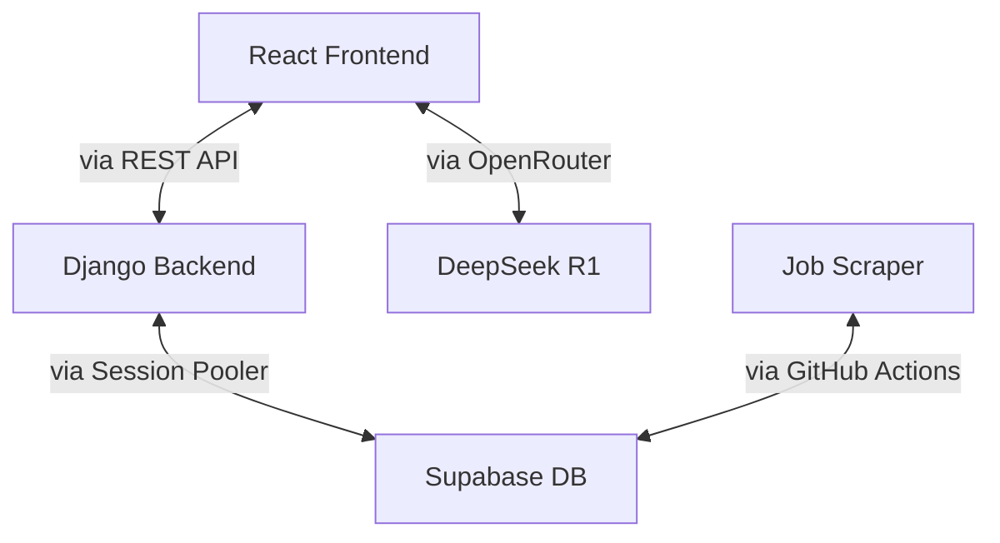

JobFLow

JobFlow is a site which one can use to find a job that suits his/her taste among 100's
of different jobs (more added daily), the site is a one stop soln where people find all
the things they need to apply for a job, from info about the Company to drafting a personalized
email tailored to the startup/comapany

Link : https://jobflow-um98.onrender.com/

Notable Features:

1) Multi-Factor Auth with SSO using Socials
2) Paginated Data Fetching
3) Tailored AI Generated Emails
4) 100's of job opeanings
5) Daily updation of new job opeanings
6) Syntactic search
7) Inline Deduplication at the data injection level

Documentation:

1) Frontend

   The fontend uses the following techonologies:
   1) Framework: React + TypeScript
   2) Build Tool: Vite
   3) Styling: TailwindCSS + shadcn/ui
   4) Authentication: Clerk
   5) HTTP Client: Axios
   6) Form Handling: React Hook Form + Zod

   The core pages are:
   1) Home (Home.tsx)
   2) Job listings (Jobs.tsx)
   3) Job Details (JobDetails.tsx)
   4) Profile (Profiel.tsx)

   The reused components like Job card (job-card.tsx), buttons etc are in the Components folder

   The Frontend needs 2 env variables to work:
   1) VITE_OPENROUTER_API
   2) VITE_BACKEND_API

2) Backend 

   The backend uses the following techonologies:
   1) Framework: Django + Django REST Framework
   2) Database: PostgreSQL (Supabase)
   3) Authentication: Clerk integration
   4) CORS: django-cors-headers

   The backend has models:
   1) Job Model:\
      class Job(models.Model):\
      title = models.CharField(max_length=255)\
      company = models.CharField(max_length=255)\
      location = models.CharField(max_length=255)\
      description = models.TextField(blank=True)\
      apply_link = models.URLField(unique=True)\
      tags = models.JSONField(default=list)\
      pay = models.CharField(max_length=100, blank=True)\
      experience = models.CharField(max_length=100, blank=True)\
      created_at = models.DateTimeField(auto_now_add=True)

   2) User Model:
      class User(models.Model):\
      clerk_id = models.CharField(max_length=100, unique=True)\
      email = models.EmailField()\
      full_name = models.CharField(max_length=100)\
      linkedin_url = models.URLField(blank=True)\
      resume_url = models.URLField(blank=True)\
      bio = models.TextField(blank=True)\
      skills = models.TextField(blank=True)

   The backend has the following endpoints:
   1) `GET /api/jobs/` - to get list of jobs (paginated)
   2) `GET /api/jobs/<id>/` - to get job details
   3) `GET /api/profile/<clerk_id>/` - to get user profile
   4) `POST /api/profile/update/` - to update profile
   5) `POST /api/sync-user/` - to sync Clerk user

   The Backend needs the following env variables to work:
    1) user
    2) password
    3) host
    4) port
    5) dbname
    6) FRONTEND_URL

3) Scraper
 
   The scraper uses the following technologies:
   1) Python
   2) BeautifulSoup4
   3) Requests
   4) psycopg2

   The scraper has 2 components:
   1) cutshort_scraper.py
   2) topstartups_scraper.py

   The Scraper is hosted on github and runs automatically at midnight everyday\
   The cron scheduel : `0 0 */1 * *`

   The Scraper needs the following env variables to work:
    1) user
    2) password
    3) host
    4) port
    5) dbname

4) AI Features

   This project uses the Deepseek model provided by OpenRouter, it main uses are:
   1) Job description enhancement when description length < 50 words
   2) Customized application emails using job details

Architecture:

link: https://excalidraw.com/#json=V-D5tVmy1QcJBflHtUBQn,KMMEwkqOZFmHAIWepyBp8A

Local Setup:

Frontend Setup:

    cd frontend\
    npm install\
    npm run dev

Backend Setup:

    cd backend\
    pip install -r requirements.txt\
    python manage.py migrate\
    python manage.py runserver

Scraper Setup:

    cd backend\
    pip install -r requirements.txt\
    python cutshort_scraper.py
    python topstartups_scraper.py

Things I would add and improve with more time:

    1) A community Fourm where prople can disscuss things like offers, prep roadmap etc.
    2) Analytics and Telemetry
    3) A portal for recrutiers to directly reach out to applicants
    4) Email Alters for when a new job with requirements similar to candidates skills
    5) Referral system 